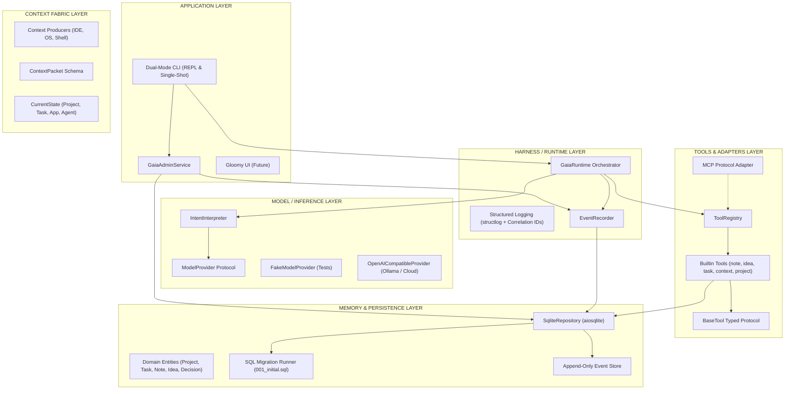
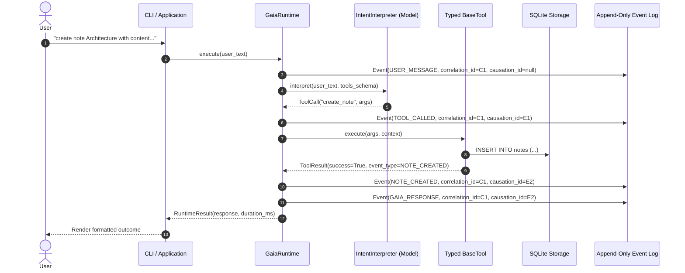

# GAIA OS — Architectural Specification

## Architectural Overview

GAIA OS is engineered according to strict principles of **I/O Isolation**, **Pure Domain Logic**, and **Inward-Facing Dependencies**.
The system is partitioned into six cleanly distinguished conceptual layers to prevent architectural entanglement.

---

## The Six Conceptual Pillars

### 1. APPLICATION
- **Definition:** The user-facing presentation and interaction surface.
- **Responsibilities:**
  - Rendering formatted terminal output, interactive prompts, and future web/desktop canvases.
  - Parsing CLI flags and administrative commands.
  - Calling application services directly for non-AI deterministic administration.
- **Rules:** The Application layer contains **zero business logic**. It delegates immediately to `GaiaRuntime` or `GaiaAdminService`.

### 2. HARNESS (Runtime)
- **Definition:** The execution harness and transaction coordinator.
- **Responsibilities:**
  - Ingress lifecycle: generating and binding asynchronous `correlation_id` values.
  - Tracking execution timing and performance metrics.
  - Coordinating the end-to-end flow: `User text → Intent interpretation → Tool execution → Persistence → Event logging → Response`.
  - Structured operation logging (`operation_started`, `operation_completed`, `operation_failed`).
- **Rules:** The Harness never implements domain rules directly. It orchestrates domain repositories, tools, and inference providers.

### 3. CONTEXT
- **Definition:** The dynamic model of the user's active digital environment.
- **Responsibilities:**
  - `ContextPacket`: Atomic units of situational awareness (source, type, payload, priority, timestamp).
  - `CurrentState`: Immediate user focus (active project UUID, active task UUID, foreground application, active agent).
  - Preparation for proactive context compilation and token budget management in future milestones.
- **Rules:** Context flows toward GAIA; the core does not engage in continuous polling or heavy scraping.

### 4. MODEL
- **Definition:** Pure statistical inference and token generation.
- **Responsibilities:**
  - `ModelProvider`: Low-level completion contract accepting `list[ChatMessage]` and JSON tool schemas.
  - `IntentInterpreter`: Uses `ModelProvider` to translate natural language into structured `ToolCall` proposals or `ConversationalResponse` messages.
- **Rules:**
  - **The model only proposes.** It NEVER directly instantiates or persists internal domain records.
  - Unit tests MUST NEVER invoke live external models; they rely on `FakeModelProvider`.
  - Model provider implementations (Ollama, OpenAI, local GGUF) must be swappable without touching GAIA Core.

### 5. TOOLS
- **Definition:** Typed executable capabilities exposed to the assistant and external agent protocols.
- **Responsibilities:**
  - `BaseTool`: Pydantic input contract, schema reflection, and execution logic.
  - Input validation: Pydantic strictly validates all incoming model arguments before domain execution.
  - `McpToolAdapter`: External boundary converting internal tools into standard Model Context Protocol (MCP) JSON schemas and execution handlers.
- **Rules:** If tool argument validation fails, execution aborts before reaching the database, and an `ACTION_FAILED` event is recorded.

### 6. MEMORY
- **Definition:** Persistent, structured knowledge and experiential records.
- **Responsibilities:**
  - Relational entities: `Project`, `Task`, `Idea`, `Note`, `Decision`.
  - Append-only event store: Every significant user action, tool call, and domain change is written with `correlation_id`, `causation_id`, and `actor`.
  - Schema migration runner: Zero-dependency, transactional SQL schema evolutions.
- **Rules:**
  - Strictly parameterized SQL (no string formatting).
  - Narrow repository protocols (`ProjectRepository`, `NoteRepository`, `EventRepository`) rather than monolithic generic CRUD interfaces.

---

## Causality and Event Architecture

Every interaction is captured as a directed acyclic graph (DAG) of causal events in SQLite:

This ensures complete auditability and builds the exact experiential dataset needed for the future Experience Engine and Teacher/Student learning loops.
